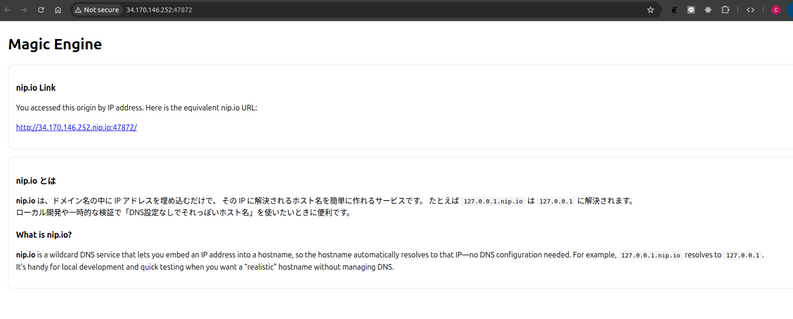
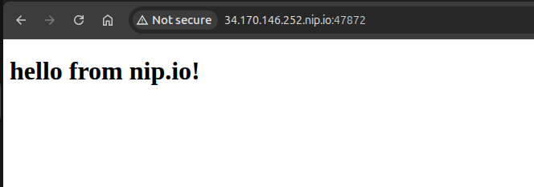
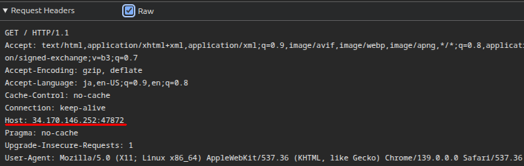
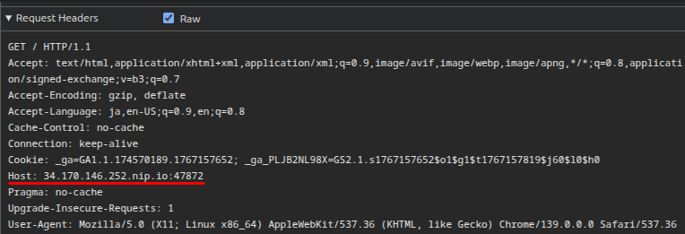

# Magic Engine

[日本語はこちら](./README-ja.md)

## Description

Nginx works like magic!

## Writeup

### Overview

The server uses Nginx to serve static files. The goal is to read `secret.html`.

```nginx
server {
    listen 80;
    server_name admin.alpaca.secret;

    root /usr/share/nginx/html;

    location = / {
        try_files /secret.html =404;
    }
}

server {
    listen 80;
    server_name *.nip.io;

    root /usr/share/nginx/html;

    location = / {
        try_files /hello.html =404;
    }
}

server {
    listen 80 default_server;
    server_name _;

    root /usr/share/nginx/html;

    location = / {
        try_files /index.html =404;
    }
}
```

When you access the remote server URL, it displays `index.html`.



When you click the link to `http://<IP>.nip.io:<PORT>/`, it displays `hello.html`.



It looks like the line `server_name *.nip.io;` tells Nginx to use the second server block when the browser uses a `*.nip.io` URL.

Does that mean accessing `http://admin.alpaca.secret/` in the browser lets us see `secret.html`?

The answer is no. `admin.alpaca.secret` must resolve to the remote server's IP address for that to work. It is not even a valid URL because `secret` is not a top-level domain (TLD) like `.com`, `.net`, or `.org`.

### Understanding the `Host` header

How does the server know which URL is used to access the IP address? The answer is the `Host` header. If you look in Chrome's inspector, you can see that the header is different when you access `http://<IP>:<PORT>/` and `http://<IP>.nip.io:<PORT>/`.





In other words, if we send a request with the `Host` header set to `admin.alpaca.secret`, we get the flag. You can do this easily with `curl`:

```sh
curl -H "Host:admin.alpaca.secret" http://34.170.146.252:47872/
```

### Unintended solution

I made a huge mistake in this challenge. If you look at the documentation for the `root` directive:

> Sets the root directory for requests. For example, with the following configuration

```
location /i/ {
    root /data/w3;
}
```

> The /data/w3/i/top.gif file will be sent in response to the “/i/top.gif” request.

This means that simply accessing `http://<IP>:<PORT>/secret.html` would work! To fix this, I should have written:

```
server {
    listen 80;
    server_name admin.alpaca.secret;

    location = / {
        alias /usr/share/nginx/html;
        try_files /secret.html =404;
    }
}
```

Huge thanks to edamame-x for mentioning this in [their writeup](https://github.com/EdamAme-x/writeup/blob/main/alpaca-hack/magic-engine/README.md)!

## Flag

```
Alpaca{Host_works_just_like_Magic}
```
