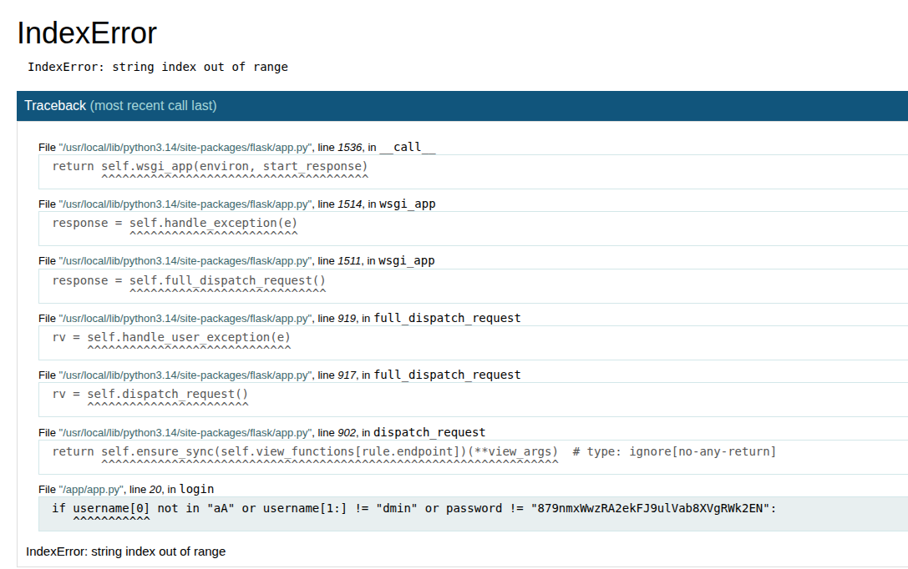

# Plz Login

[日本語はこちら](./README-ja.md)

## Description

Please login! I won't tell you the password tho!

## Writeup

### Overview

The goal is simple: log in to this server by predicting the password.

```python
from flask import Flask, request, render_template
import os
import random 

FLAG = os.environ.get("FLAG", "Alpaca{**REDACTED**}")

app = Flask(__name__)
app.secret_key = random.randbytes(32).hex()

@app.get("/")
def index():

    return render_template("login.html")

@app.post("/login")
def login():
    username = request.form.get("username", "")
    password = request.form.get("password", "")

    if username[0] not in "aA" or username[1:] != "dmin" or password != "**REDACTED**":
        return render_template("login.html", error="You are not Admin"), 401

    return render_template("flag.html", flag=FLAG)

if __name__ == "__main__":
    app.run(host="0.0.0.0", port=3000, debug=True)
```

### Solution

The core vulnerability is that the server runs with `debug=True`. This enables debug features that are not secure in production.

One of them is showing a traceback when an error occurs. If you can trigger an error near the line with the password, that line will be shown in the response.

Here, `username[0]` raises an `IndexError` if `username` is an empty string. You can use `curl` or Python to do this (see [`solve.py`](./solve.py)), or edit the HTML in the browser and remove `minlength="5"` to submit the form with an empty username.



Use the leaked password to get the flag!

### Flag

```
Alpaca{fulasukuuuuuuuuu_in_d3bug_m0de}
```
