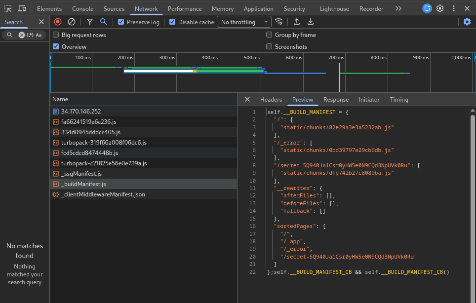

# What's Next

[日本語はこちら](./README-ja.md)

## Description

I love Next.js!

### Beginner Hint 1: Overview of the Challenge

- If you read the `Dockerfile`, you can see that `secret.js` is renamed to a random filename. So instead of `/secret`, you need to access `/secret-{32 random characters}`.
- The rest of the code looks like a minimal Next.js setup.

### Beginner Hint 2: How to Approach the Challenge

- What kind of network requests are made when you access the main page?
- Someone may have reported having trouble because a hidden page was discovered in the past. Try searching the internet.

## Writeup

### Solution 1: Inspecting the browser's Network tab

If you inspect the resources loaded in the browser's Network tab, you can see that the list of valid pages is included in `_buildManifest.js`.

### Solution 2: Searching for similar issues on the internet

For CTF challenges that use a widely used framework or library, it is often worth searching Google or GitHub for similar reports. For this challenge, [this discussion](https://github.com/vercel/next.js/discussions/61755) describes the exact issue.

> But thanks to your hint I found where all pages are listed: `_next/static/HASH_0123456789_HASH/_buildManifest.js`

## Flag

`Alpaca{wh1ch_i5_worse?rand0mized_path_0r_pag3s_rout3r?}`
